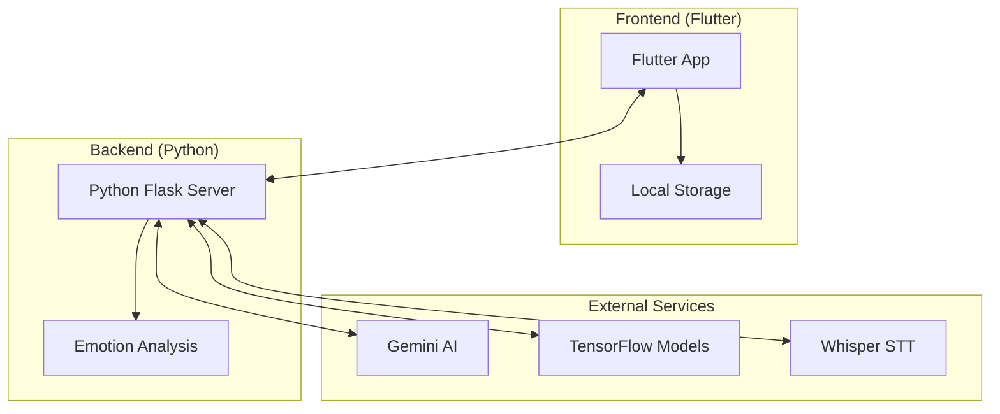

# BeMore: VAD 기반 멀티모달 감정 분석 & CBT 회고 시스템

<div align="center">


**과학적 감정 분석으로 더 나은 내일을 만들어가는 AI 기반 정신건강 관리 앱**

[](https://flutter.dev/)
[](https://www.python.org/)
[](https://ai.google.dev/)
[](LICENSE)

</div>

---

## 📖 목차

- [🎯 프로젝트 개요](#-프로젝트-개요)
- [✨ 주요 기능](#-주요-기능)
- [🏗️ 시스템 아키텍처](#️-시스템-아키텍처)
- [🚀 빠른 시작](#-빠른-시작)
- [🛠️ 기술 스택](#️-기술-스택)
- [📱 앱 구조](#-앱-구조)
- [🔧 개발 가이드](#-개발-가이드)
- [📊 API 명세](#-api-명세)
- [🎨 디자인 시스템](#-디자인-시스템)
- [📈 로드맵](#-로드맵)
- [🤝 기여하기](#-기여하기)
- [📄 라이선스](#-라이선스)

---

## 🎯 프로젝트 개요

BeMore는 **VAD(Valence-Arousal-Dominance) 기반 멀티모달 감정 분석 & CBT(인지행동치료) 회고 시스템**입니다. 

### 🌟 핵심 가치

- **🔬 과학적 감정 분석**: VAD 모델을 통한 정량적 감정 측정
- **🎭 멀티모달 통합**: 얼굴 표정, 음성, 텍스트의 융합 분석
- **🤖 AI 기반 상담**: Gemini AI를 활용한 자연스러운 대화형 상담
- **🧠 CBT 치료**: 인지행동치료 기법을 통한 체계적 정신건강 관리
- **�� 개인화 피드백**: 사용자별 맞춤형 감정 관리 전략

### 🎯 타겟 사용자

- 정신건강에 관심이 있는 일반 사용자
- 감정 관리가 필요한 직장인/학생
- CBT 치료를 받고 있는 환자
- 정신건강 전문가 (모니터링 도구)

---

## ✨ 주요 기능

### 📊 멀티모달 감정 분석

| 기능 | 설명 | 기술 |
|------|------|------|
| **얼굴 표정 분석** | 실시간 카메라를 통한 표정 인식 | TensorFlow + OpenCV |
| **음성 감정 분석** | 음성 톤과 패턴을 통한 감정 파악 | Whisper + 음성 분석 모델 |
| **텍스트 감정 분석** | 입력된 텍스트의 감정 상태 분석 | 자연어 처리 |
| **VAD 통합 분석** | 3차원 감정 수치화 (Valence, Arousal, Dominance) | 가중 평균 알고리즘 |

### 🤖 AI 기반 대화 시스템

- **Gemini AI 연동**: Google Gemini Pro를 활용한 자연스러운 한국어 대화
- **음성 인식**: 실시간 STT(Speech-to-Text) 기능
- **대화 히스토리**: 컨텍스트 유지 (최대 10턴)
- **정신건강 특화**: 상담에 최적화된 프롬프트

### 🧠 CBT 기반 맞춤 피드백

| 감정 상태 | 인지 왜곡 | CBT 기법 |
|-----------|-----------|----------|
| **슬픔** | 과도한 일반화 | 행동 활성화, 감사 일기 |
| **불안** | 재앙화 | 점진적 근육 이완, 마음챙김 |
| **분노** | 개인화 | 타임아웃, 인지 재구성 |
| **기쁨** | 과도한 낙관 | 감사 표현, 긍정적 경험 확장 |

### 📈 데이터 관리 & 리포트

- **세션 기록**: 모든 감정 분석 세션의 상세 기록
- **감정 변화 추적**: 시간에 따른 VAD 값 변화 그래프
- **PDF 리포트**: 종합적인 감정 분석 리포트 생성
- **통계 분석**: 일별/주별/월별 감정 패턴 분석

---

## 🏗️ 시스템 아키텍처



### 데이터 플로우

```
1. 사용자 입력 (카메라/마이크/텍스트)
   ↓
2. Flutter 앱에서 데이터 전처리
   ↓
3. Python 서버로 멀티모달 데이터 전송
   ↓
4. 각 모달리티별 감정 분석 실행
   ↓
5. VAD 기반 통합 분석 결과 생성
   ↓
6. CBT 피드백 및 AI 응답 생성
   ↓
7. 클라이언트로 결과 전송 및 UI 업데이트
```

---

## 🚀 빠른 시작

### 📋 사전 요구사항

- Flutter 3.x
- Python 3.8+
- Google Gemini AI API 키
- 카메라 및 마이크 권한

### 1️⃣ 환경변수 설정

프로젝트 루트에 `.env` 파일을 생성하세요:

```env
# Emotion Analysis API Server URL
EMOTION_API_URL=http://localhost:5001

# Gemini AI API Key (AI 채팅 기능에 필수)
GEMINI_API_KEY=your_actual_gemini_api_key_here

# OpenAI API Key (기존 GPT 서비스용)
OPENAI_API_KEY=your_openai_api_key_here
```

### 2️⃣ Gemini API 키 발급

1. [Google AI Studio](https://makersuite.google.com/app/apikey)에 접속
2. Google 계정으로 로그인
3. "Create API Key" 버튼 클릭
4. 생성된 API 키를 `.env` 파일에 설정

### 3️⃣ 서버 실행

```bash
# Python 가상환경 생성
python -m venv venv
source venv/bin/activate  # macOS/Linux
# 또는
venv\Scripts\activate     # Windows

# 의존성 설치
pip install -r requirements.txt

# 서버 실행
python multimodal_emotion_api.py
```

### 4️⃣ Flutter 앱 실행

```bash
# 의존성 설치
flutter pub get

# 앱 실행
flutter run
```

---

## 🛠️ 기술 스택

### Frontend (Flutter)

| 기술 | 버전 | 용도 |
|------|------|------|
| **Flutter** | 3.x | 크로스 플랫폼 앱 개발 |
| **Provider** | 6.x | 상태 관리 |
| **camera** | 0.10.x | 카메라 접근 |
| **record** | 5.x | 음성 녹음 |
| **speech_to_text** | 6.x | 실시간 음성 인식 |
| **http** | 1.x | API 통신 |
| **flutter_dotenv** | 5.x | 환경변수 관리 |
| **google_fonts** | 6.x | 커스텀 폰트 |
| **lottie** | 2.x | 애니메이션 |
| **fl_chart** | 0.65.x | 차트 및 그래프 |
| **pdf** | 3.x | PDF 리포트 생성 |

### Backend (Python)

| 기술 | 버전 | 용도 |
|------|------|------|
| **Flask** | 2.x | 웹 프레임워크 |
| **TensorFlow** | 2.x | 얼굴 감정 분석 |
| **Whisper** | 1.x | 음성-텍스트 변환 |
| **google-generativeai** | 0.3.x | Gemini AI 연동 |
| **OpenCV** | 4.x | 이미지 처리 |
| **numpy** | 1.x | 수치 계산 |

### 외부 서비스

| 서비스 | 용도 | API |
|--------|------|------|
| **Google Gemini AI** | 대화형 AI | REST API |
| **TensorFlow Hub** | 사전 훈련 모델 | Python API |
| **OpenAI Whisper** | 음성 인식 | Python API |

---

## 📱 앱 구조

### 메인 네비게이션

| 화면 | 기능 | 설명 |
|------|------|------|
| **🏠 홈** | 대시보드 | 오늘의 감정 상태, 빠른 시작, AI 대화 |
| **👥 소셜** | 커뮤니티 | 그룹 상담, 커뮤니티 기능 (개발 중) |
| **📊 기록** | 히스토리 | 과거 분석 기록 및 통계 |
| **⚙️ 설정** | 앱 설정 | 데이터 관리, 앱 정보, 권한 설정 |

### 핵심 기능 화면

| 화면 | 기능 | 설명 |
|------|------|------|
| **🎬 온보딩** | 앱 소개 | 사용법 안내, 권한 요청 |
| **📹 멀티모달 세션** | 실시간 분석 | 카메라, 마이크, 텍스트 통합 분석 |
| **💬 AI 채팅** | 대화형 상담 | Gemini AI와의 자연스러운 대화 |
| **📈 분석 결과** | 결과 표시 | 상세한 감정 분석 결과 및 CBT 피드백 |
| **📋 히스토리** | 기록 조회 | 과거 분석 기록 및 통계 |

---

## 🔧 개발 가이드

### 프로젝트 구조

```
lib/
├── components/          # 재사용 가능한 UI 컴포넌트
├── constants/           # 상수 정의
├── models/             # 데이터 모델
│   ├── vad_emotion.dart
│   ├── cbt_feedback.dart
│   ├── chat_message.dart
│   └── session_data.dart
├── providers/          # 상태 관리 (Provider)
├── screens/            # 화면 UI
│   ├── analysis/       # 분석 관련 화면
│   ├── chat/          # AI 채팅 화면
│   ├── history/       # 기록 화면
│   ├── home/          # 홈 화면
│   ├── onboarding/    # 온보딩 화면
│   ├── record/        # 녹음 화면
│   ├── report/        # 리포트 화면
│   ├── session/       # 세션 화면
│   └── settings/      # 설정 화면
├── services/           # 비즈니스 로직
├── theme/             # 디자인 시스템
├── utils/             # 유틸리티 함수
└── widgets/           # 커스텀 위젯
```

### 핵심 데이터 모델

#### VAD 감정 모델
```dart
class VADEmotion {
  final double valence;    // 감정의 긍정성 (0.0 ~ 1.0)
  final double arousal;    // 감정의 활성화 정도 (0.0 ~ 1.0)
  final double dominance;  // 감정의 지배성 (0.0 ~ 1.0)
  final DateTime timestamp;
  final String source;     // 'facial', 'voice', 'text', 'combined'
}
```

#### CBT 피드백 모델
```dart
class CBTFeedback {
  final String cognitiveDistortion;  // 인지 왜곡 유형
  final String challenge;            // 도전 과제
  final String reframe;              // 인지 재구성
  final String actionPlan;           // 행동 계획
  final List<String> techniques;     // CBT 기법들
}
```

### 코딩 컨벤션

```dart
// 클래스명: PascalCase
class MultimodalAnalysisService {}

// 변수/함수명: camelCase
String emotionCategory;
Future<void> analyzeEmotion() {}

// 상수: SCREAMING_SNAKE_CASE
static const String API_BASE_URL = 'http://localhost:5001';
```

---

## 📊 API 명세

### 서버 API (포트 5001)

#### 멀티모달 감정 분석
```http
POST /analyze_multimodal_emotion
Content-Type: application/json

{
  "image": "base64_encoded_image_data",
  "audio": "base64_encoded_audio_data", 
  "text": "사용자 입력 텍스트",
  "sessionId": "unique_session_id"
}
```

#### Gemini AI 채팅
```http
POST /chat/gemini
Content-Type: application/json

{
  "message": "사용자 메시지",
  "conversation_history": [
    {"role": "user", "content": "이전 메시지"},
    {"role": "model", "content": "AI 응답"}
  ]
}
```

#### 서버 상태 확인
```http
GET /health
```

### 클라이언트 API 서비스

```dart
// 감정 분석 서비스
class EmotionAPIService {
  static Future<Map<String, dynamic>> analyzeMultimodal({
    String? base64Image,
    String? base64Audio,
    String? text,
  });
}

// AI 채팅 서비스
class GeminiService {
  Future<String> getResponse(String userMessage);
  Future<void> clearConversation();
  List<Map<String, String>> getConversationHistory();
}
```

---

## 🎨 디자인 시스템

### BeMore 브랜드 컬러

```dart
class BeMoreTheme {
  static const Color primaryColor = Color(0xFF6366F1);      // 인디고
  static const Color secondaryColor = Color(0xFF8B5CF6);    // 바이올렛
  static const Color accentColor = Color(0xFF06B6D4);       // 시안
  static const Color backgroundColor = Color(0xFFF8FAFC);   // 연한 회색
  static const Color surfaceColor = Color(0xFFFFFFFF);      // 흰색
}
```

### 감정별 컬러 매핑

| 감정 | 컬러 | HEX |
|------|------|------|
| **기쁨** | 초록색 | #10B981 |
| **평온** | 파란색 | #3B82F6 |
| **슬픔** | 인디고 | #6366F1 |
| **불안** | 주황색 | #F59E0B |
| **분노** | 빨간색 | #EF4444 |
| **중립** | 회색 | #6B7280 |

### 디자인 원칙

- **Material Design 3**: 모던하고 일관된 디자인
- **한국어 최적화**: Noto Sans KR 폰트 사용
- **접근성**: 색상 대비 및 터치 영역 최적화
- **감정별 테마**: 사용자 감정에 따른 UI 색상 변화

---

## 📈 로드맵

### 🎯 단기 목표 (1-3개월)
- [ ] 실시간 얼굴 감정 인식 정확도 향상
- [ ] 음성 감정 분석 모델 개선
- [ ] CBT 피드백 시스템 고도화
- [ ] 사용자 개인화 기능 추가

### 🚀 중기 목표 (3-6개월)
- [ ] 소셜 기능 구현 (커뮤니티, 그룹 상담)
- [ ] 전문가 모드 개발 (의료진용)
- [ ] 다국어 지원 (영어, 일본어)
- [ ] 웹 버전 개발

### 🌟 장기 목표 (6개월 이상)
- [ ] AI 모델 자체 개발
- [ ] 임상 연구 및 검증
- [ ] 의료기기 인증 준비
- [ ] 글로벌 서비스 확장

---

## 🤝 기여하기

BeMore 프로젝트에 기여하고 싶으시다면 환영합니다!

### 기여 방법

1. **Fork** 이 저장소
2. **Feature branch** 생성 (`git checkout -b feature/AmazingFeature`)
3. **Commit** 변경사항 (`git commit -m 'Add some AmazingFeature'`)
4. **Push** 브랜치 (`git push origin feature/AmazingFeature`)
5. **Pull Request** 생성

### 개발 환경 설정

자세한 개발 가이드와 기술 문서는 [📖 상세 기술 문서](docs/BEMORE_SERVICE_DOCUMENTATION.md)를 참조하세요.

### 버그 리포트

버그를 발견하셨다면 [Issues](../../issues)에 등록해 주세요.

---

## 📄 라이선스

이 프로젝트는 MIT 라이선스 하에 배포됩니다. 자세한 내용은 [LICENSE](LICENSE) 파일을 참조하세요.

---

## 📞 연락처

- **프로젝트 리더**: [이메일 주소]
- **기술 문의**: [이메일 주소]
- **버그 리포트**: [GitHub Issues](../../issues)

---

<div align="center">

**BeMore와 함께 더 나은 정신건강을 만들어가세요! 🧠💙**

*과학적 감정 분석으로 당신의 감정을 이해하고, AI 기반 상담으로 더 나은 내일을 만들어갑니다.*

</div> 